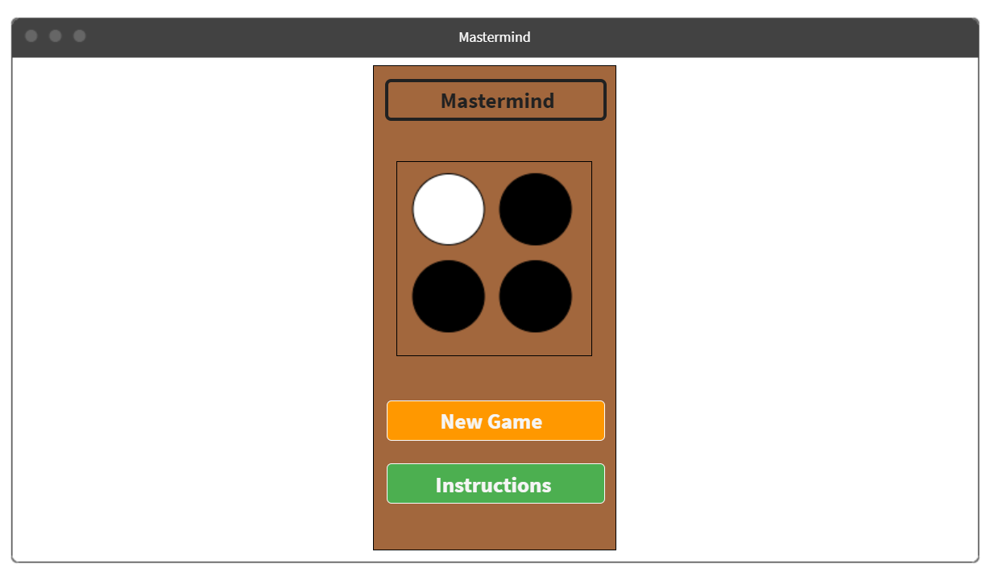
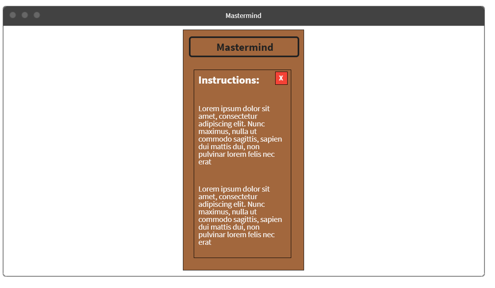
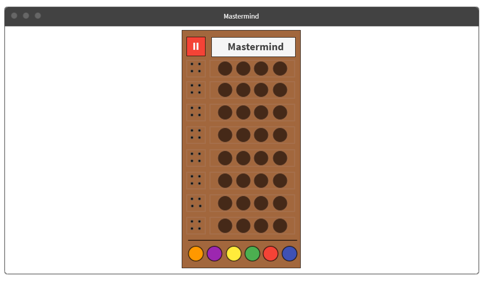
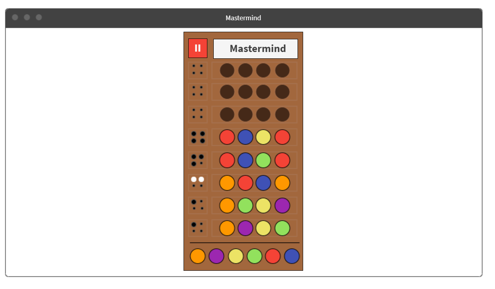
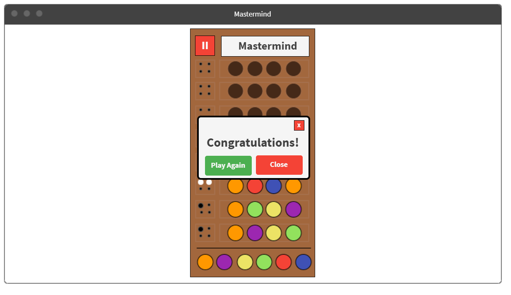
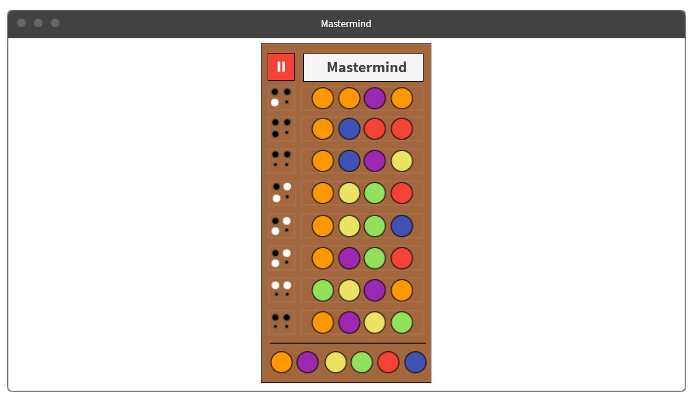
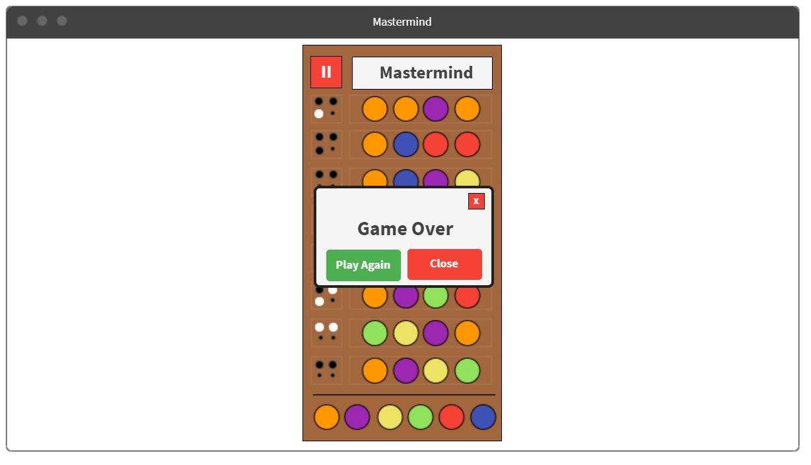

# Mastermind 

## Project Description

Mastermind is a board game for two players. Simply, the first player is trying the guess the secret code given by the other player. The secret code is a sequence of colours, for example 4 colours. There are a number of attempts and with each attempt the player will receive a respond as a hint. There are two kinds of hints. First, right colour in the right position. Second, right colour but in the wrong position. Each hint will be represented as a colour. usually black and white. Black if both the colour and postion are right, on the other hand, white represents only a right colour. 

In the project, the players will be the user and the computer. The user shall select the sequence of colours. The application shall check if the sequence is matched. The application shall show the respond as below:

- If there is any matched colour and position, show a black circle.
- if there is any matched colour only and position is wrong, show a white circle.
- If there are no colours matched, show none.


## Project Wireframe
<p align="center">
  
  <i>Fig. 1: The home page</i>
  <br><br>
  
  <i>Fig. 2: The instructions page</i>
  <br><br>
  
  <i>Fig. 3: The main game page</i>
  <br><br>
  
  <i>Fig. 4: Case-1 when user wins</i>
  <br><br>
  
  <i>Fig. 5: The message shown when user wins</i>
  <br><br>
  
  <i>Fig. 6: Case-2 when user loses</i>
  <br><br>
  
  <i>Fig. 7: The message shown when user loses</i>
</p>

## Technologies Used
- [Wireframe tool](https://mockflow.com/app/#Wireframe)
- PL: HTML, CSS, JS
- VS Code editor.
- Chrome Developer tool.

## Approach Taken
First Dealing with the board as arrays: 
- Array for the whole matrix.
- Arrays for the hints/attempts that being updated depending on the round.

Cmputer shall check the entries **for each round**, and compare it with the secret code:
- Compare the colour & postions in a single loop.
- Compare the existance of the colour in a single loop.
- Print out the hints if exist.

Then, the computer shall check the conditon of the win:
- Check if the hints contins 4 blacks, if so, user wins.
- And if the attempts ends with no 4 blacks gaind, the user loses.

After the game ends either by a win or loss, computer shall show the secret code.

## Installation Instructions

```
$ git clone https://git.generalassemb.ly/manalshehri/Mastermind.git
$ cd Mastermind
```

## Future Suggestion and Inhancment

- Add levels: easy, normal and hard.
- Store the user's score. 
- Enhance the user experience.

## Resources
- To understand the game more, check this [video](https://youtu.be/wsYPsrzCKiA)
- You can play the game [here](https://pages.git.generalassemb.ly/manalshehri/Mastermind/)
