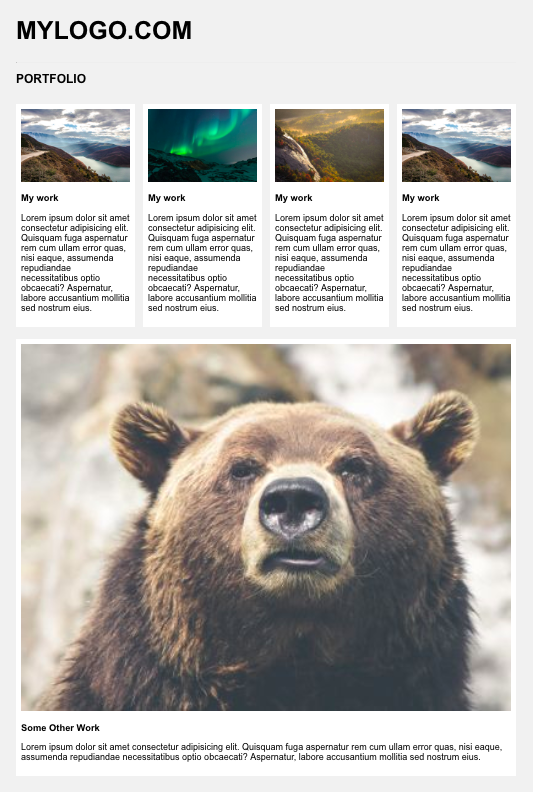

## Mockup (HTML/CSS)

### Hints
- Background color: #f1f1f1
- Container max width: 1000px
- To clear floats after rows (separate columns & rows): ```.row:after {
    content: "";
    display: table;
    clear: both;
}```

## requmient
you have the html file and css file , start your code inside the css and the html to let the website look like this : 


## Imgage Links
- https://www.w3schools.com/w3images/mountains.jpg
- https://www.w3schools.com/w3images/lights.jpg
- https://www.w3schools.com/w3images/nature.jpg
- https://www.w3schools.com/w3images/mountains.jpg
- https://www.w3schools.com/w3images/p3.jpg