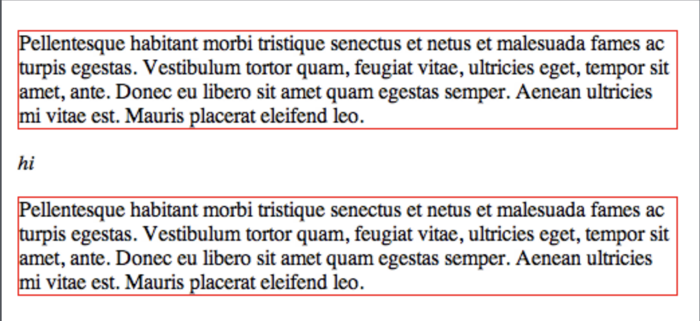
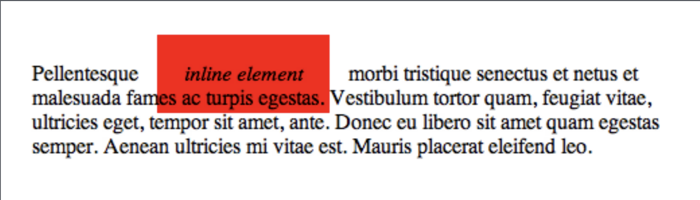
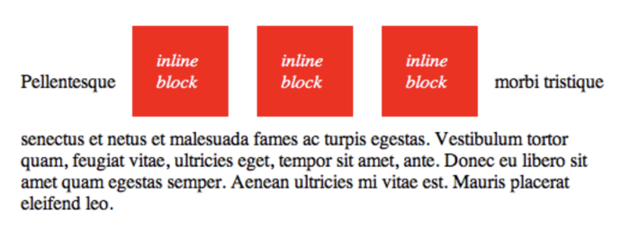

# HTML & CSS

## Learning Objectives

- Review the roles of HTML and CSS in web pages
- Identify the parts of an HTML element
- Identify the parts and roles of HTML boiler plate
- Break down the syntax of a CSS declaration and a CSS rule(set)
- List commonly used properties
- Distinguish the components of the box model

## Overview

This lesson will be a refresher on the fundamentals of HTML and CSS. All
material is review from the pre-work, so we will move quickly and potentially
glosses over material. For a much more robust treatment, please see [the Mozilla
Developer Network Learning
Area](https://developer.mozilla.org/en-US/docs/Learn).

### Discussion Questions

- What are the only 3 languages that browsers can understand?  
- What are their general roles in how a webpage displays information?

## HTML (Hyper Text Markup Language)

HTML exists to solve the problem of how a rich document can be expressed in
plain text. That is to say what are the parts of the document, what role does
each part serve (e.g. heading, image, list, emphasized text, link etc.), and how
do they relate to one another.

HTML expresses the **structure and semantics** of a document in plain text.

### Elements: I do 


The parts of an HTML document are called **elements** and they are denoted with
**tags**. Tags come at the beginning and end of an element's content.


Extra information about elements can be added using **attributes** which are
added to the _opening tag_. A ubiquitous element which always needs an attribute
is the `a` (for *anchor*) element. The `a` element creates a link to another
location, frequently another page.

We express the structure of an HTML document by nesting. For example, we can
take a paragraph:

```html
<p>The easiest way to learn HTML is to use it!</p>
```

and we can emphasize part of the text using `em` tags:

```html
<p>The easiest way to learn HTML <em>is to use it!</em></p>
```

We can add a link to the word `HTML` that goes to the MDN HTML page
(https://developer.mozilla.org/en-US/docs/Web/HTML)

```html
<p>
  The easiest way to learn
  <a href="https://developer.mozilla.org/en-US/docs/Web/HTML">HTML</a>
  <em>is to use it!</em>
</p>
```

Notice the use of whitespace (line-breaks and indentation) here. Any amount of
whitespace is understood as a single space to the browser which lets us spread
our content out for readability.

An element can be the child of another element (contained within its parent's
tags) but can never straddle another element.

```html
<!-- Don't do this! -->
<p>The easiest way to learn HTML <em>is to use it!</p></em>
```

Similarly, do not omit closing tags. Every element needs a closing tag (with the
exception of **empty elements**).

```html
<!-- Also, don't do this! -->
<p>The easiest way to learn HTML <em>is to use it!</em>
```

Browsers try to correct our mistakes, and this is often unhelpful because they don't provide us with informative errors. [HTML validators](https://validator.w3.org/nu/#textarea) and our linter can help us out though. Even our
valid example above (with the anchor tag) won't validate just yet as we are
missing some required boiler plate.

### HTML Boilerplate

When a client's browser gets an HTML file from the server, it begins building a
document that will be displayed to the user.

The following HTML boilerplate tells the browser how to construct the page:

```html
<!DOCTYPE html>
<html>
  <head>
    <meta charset="utf-8">
    <title>This is the title</title>
  </head>
  <body>

  </body>
</html>
```

The first line `<!DOCTYPE html>` declares that the document is an HTML document and specifically, this doctype declaration tells the browser that the page should be interpreted using the HTML5 specification.

Every webpage is enclosed in `html` tag defining the start and end of the
document. The closing `html` tag should always be the last line of the page.

The `html` element has **two children**, `head` and `body`. Both `head` and `body`
are required and they are the only two valid children of `html`.

#### Head

The `head` element holds **metadata** about the document; metadata meaning extra
information about the document beyond the content of the document.

One required piece of metadata is the `title` element. Every page is required to
have a title; without one the HTML document is invalid. The `title` element
defines what shows up in the browser window, what the page is called when added
to favorites/bookmarks, and what the page is titled in search-engine results.

The `meta` element declares that the *charset* or set of characters used in this
document is **utf-8** which includes most characters from all known human
languages. This is not required but can avoid some problems you might run into
if you use special characters.  The charset declaration should fit completely within the first 1024 bytes at the start of the file, so it's best to put it immediately after the opening head tag.

Two other meta tags that may autofill into HTML5 boilerplate:

- `<meta name="viewport" content="width=device-width, initial-scale=1.0">` 
  - This sets the width of the area in which the content renders (the viewport)
    to the width of the device and sets the scale to 1. You can read more about
    this
    [here](https://developer.apple.com/library/content/documentation/AppleApplications/Reference/SafariWebContent/UsingtheViewport/UsingtheViewport.html#//apple_ref/doc/uid/TP40006509-SW26).

Other examples of metadata include links to external stylesheets (more later)
and scripts to run on the page.

> There are MANY options for the meta tag. So many that there's probably not an exhaustive list anywhere.

#### Body

The `body` element contains the information actually presented to the user; it
represents the content of the document.

### Valid HTML in a file: We Do

Before we start adding content to the body lets create a file locally for our
work so we can open it.

> Note: All code for this lesson is available in [this repo](https://github.com/ga-wdi-exercises/html-css-in-class/tree/master) with branches for each step.

Create a directory in your sandbox called `html-and-css`

```bash
cd ~/sei/sandbox
mkdir html-and-css
cd html-and-css
```

Create a file `index.html` and open it with Visual Studio Code

```bash
touch index.html
code .
```

We'll be using [Emmet](https://code.visualstudio.com/docs/editor/emmet) which gives us tools to write our html code more quickly and accurately. To create our HTML boilerplate, type `!` inside an empty document that has a `.html` extension and press the tab key.

> In programming we often refer to the exclamation point as a _bang_.

Next, use the tab key to navigate to the title and replace its contents.  Now you can move your cursor in between the body tags and type `p`, then press the tab key.

Inside the `<p></p>` tags that were generated, type: `The easiest way to learn HTML is to use it!`.  Select the word `HTML` in the text you added and press command <kbd>⌘</kbd> + shift <kbd>shift</kbd> + <kbd>P</kbd> (or Ctrl + Shift + P on Windows machines) to bring up the command palette.   Start typing: `emmet wrap individ` and select the option that reads:  `Emmet: Wrap Individual Lines with Abbrevation`.  After you've selected this option just type `a` and press enter.   Do the same to wrap the text `is to use it!` with an `em` tag.


Now, `index.html` should look like this:

```html
<!DOCTYPE html>
<html lang="en">
<head>
  <meta charset="UTF-8" />
  <meta name="viewport" content="width=device-width, initial-scale=1.0" />
  <title>HTML &amp; CSS</title>
</head>
<body>
  <p>
    The easiest way to learn
    <a href="https://developer.mozilla.org/en-US/docs/Web/HTML">HTML</a>
    <em>is to use it!</em>
  </p>
</body>
</html>
```

Cool, let's fire up a local web server and see this file in the browser.   You may have previously opened up a html file in. the browser by simply double-clicking it or dragging it into the browser.  That technique will **not** work as we start to use features in JavaScript that are only supported on a web server.  So from this point forward, we'll be running **all** of our code using a local server.  One additional benefit of doing this is that the local server we'll be using includes _live reload_ features, so any of the changes that you make in the editor will automatically appear in the browser!

At the bottom of the VS Code editor, toward the right side of the screen click the text that reads:  `Go Live`.  If you do not see the `Go Live` text at the bottom of the editor,  click the gear icon on the bottom left side of the editor or press command <kbd>⌘</kbd> + shift <kbd>shift</kbd> + <kbd>P</kbd> again to open the command palette and type: `open with live` then select the `Live Server: Open with Live Server` option from the palette. 

This is valid HTML. We can confirm this by copying and pasting the code into an
[HTML validator](https://validator.w3.org/nu/#textarea).

*(Note: in the title we are using an [HTML
entity](https://developer.mozilla.org/en-US/docs/Glossary/Entity) for the
ampersand.)*

### Exercise: You Do [HTML Fixit](../../../html-fix-it)

- 10 minutes working / 5 minutes review
- Work with a partner and write out plain English answers
- If you finish early, add additional HTML trying to provoke various error
  messages

## More Elements

There are tons of different HTML elements and memorizing them is impractical.
Instead, it is better to start using the 20 percent of the building blocks that
get you 80 percent of the way there. Among these are headings, paragraphs,
lists, and images.

### Headings

The `h1` - `h6` tags are for headings and subheadings. It's rare to use past 3
or 4.

```html
<h1>I'm most important! There should really only be one of me on a page.</h1>
<h2>I'm still quite important! I'm fine being on the page a few times though</h2>
<h3>I'm pretty common!</h3>
<h4>I'm quite detailed</h4>
<h5>I'm probably deep in a menu</h5>
<h6>Wow, that's very detailed</h6>
```

### Lists

People love lists. There are two types of HTML lists, ordered and unordered.

```html
<!-- ordered list -->
<ol>
  <li>I'm first</li>
  <li>I'm second</li>
  <li>I'm third</li>
</ol>
<!-- unordered list -->
<ul>
  <li>red</li>
  <li>green</li>
  <li>blue</li>
</ul>
```

### Images

If there's anything people like more than lists, it's images.

Images are **empty elements** meaning that they cannot logically have children.
They are represented in HTML with a single, self-closing element.

Some people put a slash at the end of empty elements but it is unnecessary.

```html

<!-- is the same as -->

```

Images require a `src` with a URL for an image.  You should also include an
`alt` tag for screen readers, and when something breaks and the image doesn't
show up.

The url can be any address but generally we want to manage our own assets.

Right click the picture and click **"Save image as..."**, give the file a
shorter name, and make sure you save it to Downloads. I've gone with
`html5logo.png`.


Move the file from your Downloads folder to the `html-and-css` directory.

```bash
mv ~/Downloads/html5logo.png ~/sei/sandbox/html-and-css/
```

We tell the browser to request an image and load it into the page by giving an
image tag's source attribute a path to the image.

```html

```

### Semantic HTML

Besides the basic elements, there are some semantic HTML elements that are important to learn to use as professional developers.  These semantic elements will improve the structure of our pages and make it easier for the more than 285 million people around the world who cannot experience our pages visually to navigate through our content.

[MDN's Element Reference](https://developer.mozilla.org/en-US/docs/Web/HTML/Element)*

These include elements like:
```html
<section>
<header>
<footer>
<nav>
<main>

```

[Reference to help you with semantic HTML](./reference/h5d-sectioning-flowchart.pdf)

#### Resources:

```
Good Strategies
===============
Imitation
Repetition
Inspection
Reflection

Good Links
==========
MDN HTML Tutorials (https://developer.mozilla.org/en-US/docs/Learn/HTML)
MDN list of inline HTML elements (https://developer.mozilla.org/en-US/docs/Web/HTML/Inline_elements)
MDN list of block level HTML elements (https://developer.mozilla.org/en-US/docs/Web/HTML/Block-level_elements)
```

## CSS (Cascading Style Sheets)

We use CSS to tell browsers how we would like for them to **display** the
elements of our document.

### Websites without CSS

So far the website we've created together has only the default styles that the browser applies. Let's checkout [CSS Zen Garden](http://www.csszengarden.com) to see some examples of the great power and diversity that CSS can have on a website.  

> Optional: You can use the chrome extension called [web developer](https://chrome.google.com/webstore/detail/web-developer/bfbameneiokkgbdmiekhjnmfkcnldhhm?hl=en-US) to disable css on any site. If you want to.

### CSS File: We do

To get started writing styles we will create a new file.

```bash
touch ~/sei/sandbox/html-and-css/style.css
```
> Notice: this is an absolute path. If you're in the `html-and-css` directory
> you can just `touch style.css`

Then we will add a line to our HTML linking the stylesheet.

```html
<link rel="stylesheet" href="style.css">
```

We can test to make sure the style sheet is linked by adding a rule (we'll break
down rules momentarily):

```css
body {
  background: lemonchiffon;
}
```

When we refresh the page, we should see the background color change.

Note: There are three ways to write CSS into your HTML file.

- **Inline** ==> `<p style="background: blue;">Inline Example</p>` 
- **Internal** ==> `<style>` element in `<head>` of html file
- **External** ==> linking an external CSS file

### CSS Rules 

CSS styles are a series of **rules** or **rulesets**. A rule is a combination of
a **selector** and a set of **declarations**.


## Selector 

A selector is a pattern used to match HTML elements to the rule that should
apply. As shown, a selector can be an element. Or, very commonly, we add `class`
or `id` attributes to mark elements for targeting by a specific rule.

- Periods '.' are used to select a class like this

```css
.class-name {
  color: red;
}
```

- Hashes '#' are used to select an id like this

```css
#id-name {
  color: blue;
}
```

Note: CSS rules that are **More Specific** will override rules that are less
specific.

- Targeting parent element ==> *Least specific*
- Targeting element directly ==> *Less specific*
- Targeting class ==> *More specific*
- Targeting id ==> *Most specific*

CSS can also overwrite itself. For example, if you have two rules that have the same precedence (like two classes), the one that appears further down in the file will overwrite the previous one.

### Classes/IDs 

Add the following to HTML file:

```html
<p>Paragraph 1</p>
<p class="paragraph">Paragraph 2</p>
<p id="p3">Paragraph 3</p>
<p id="p4" class="paragraph">Paragraph 4</p>
```

Then add this to the CSS file:

```css
p {
  color: red;
  font-size: 24px;
}
.paragraph {
  color: purple;
  font-size: 36px;
}
#p3 {
  color: blue;
}
#p4 {
  color: yellow;
}
```

Selectors can be combined and related and there are many more types of
[selectors](https://developer.mozilla.org/en-US/docs/Learn/CSS/Introduction_to_CSS/Selectors).

**Bonus**: Especially interesting are [pseudo class
selectors](https://developer.mozilla.org/en-US/docs/Learn/CSS/Introduction_to_CSS/Pseudo-classes_and_pseudo-elements).

### Exercise: You do [CSS Diner](http://flukeout.github.io/)

- 15 minutes working / 5 minutes review

### Declaration 

A declaration has two parts, a property and a value to which that property
should be set. In the example above, the property is `color` and the property value is `red`.

There must be a colon separating each property from its property value and a
semicolon at the end of the declaration. By adding just that rule to our CSS and
refreshing the page in the browser, we can see the effect of the rule.

### Properties 

Like HTML elements, there are tons of css properties and it is impractical to
memorize them. Again we're looking for the 20% that gets us 80% of the way.

Here are some good ones to know:

#### [Background](https://developer.mozilla.org/en-US/docs/Web/CSS/background)

There is a ton we can do with the background of a page but for now we'll keep it
simple just setting its color to off white. Generally we will use a
[**hex-triplet**](https://en.wikipedia.org/wiki/Web_colors#Hex_triplet) to
describe colors.

Let's get back to building out our "Learn HTML" page.

In `style.css` replace the `lemonchiffon` background with:

```css
body {
  background: #F5F5F5;
}
```

**BONUS** The background property can also be set to a [linear gradient](https://developer.mozilla.org/en-US/docs/Web/CSS/linear-gradient) or [radial gradient](https://developer.mozilla.org/en-US/docs/Web/CSS/radial-gradient) which can even be used to produce [amazing repeating patterns](https://leaverou.github.io/css3patterns/).

#### [Text](https://developer.mozilla.org/en-US/docs/Learn/CSS/Styling_text/Fundamentals)

#### [Color](https://developer.mozilla.org/en-US/docs/Web/CSS/color)

The color property sets the color of text. An easy improvement to the default
styling is to set the text color to something just off black. For off black, we
will use `#444`.

In `style.css` add the declaration to the body rule:

```css
body {
  color: #444;
  background: #F5F5F5;
}
```

#### [Font Family](https://developer.mozilla.org/en-US/docs/Learn/CSS/Styling_text/Fundamentals#Font_families)

A less subtle change we can easily make is to use a font other than the default
`Times`.

See below for details on bringing in custom fonts from Google Fonts. For now
we'll just use some of the **web safe fonts** which are available by default in
almost every browser. Some web safe fonts are:

- Arial (sans-serif)
- Courier New (monospace)
- Courier (monospace)
- Georgia (serif)
- Palatino (serif)
- Times New Roman (serif)
- Trebuchet MS (sans-serif)
- Verdana (sans-serif)

Because there can be problems loading fonts, we provide the `font-family`
property fallbacks in a comma separated list. Also note that fonts with a space
in their name need to be surrounded in quotation marks.

Let's add a declaration to the rule on body setting the font-family to a
sans-serif font:

```css
body {
  color: #444;
  background: #F5F5F5;
  font-family: Helvetica, Arial, sans-serif;
}
```

Notice the lower-case, dash deliminated property (sometimes called spine-case)
naming convention for multi-word properties.

Let's also add a new ruleset that just applies to the `h1` and give that a
monospaced font.

```css
h1 {
  font-family: "Courier New", Courier, monospace;
}
```

#### [Font size](https://developer.mozilla.org/en-US/docs/Learn/CSS/Styling_text/Fundamentals#Font_size)

A very common mistake is to use a header with a larger number (e.g. `h4`) for
the smaller font. This is bad practice. Instead we want to use the heading with
the appropriate meaning and then style appropriately.

Let's use a slightly smaller font for our h1 than the default `32px`:

```css
h1 {
  font-family: "Courier New", Courier, monospace;
  font-size: 24px;
}
```

**Bonus** there's a lot more you can do with [Font
styling](https://developer.mozilla.org/en-US/docs/Learn/CSS/Styling_text/Fundamentals#Font_style_font_weight_text_transform_and_text_decoration)
like text decorations and shadows!

For more detail on units of measurement in CSS check out [this Values and Units
guide](https://developer.mozilla.org/en-US/docs/Learn/CSS/Introduction_to_CSS/Values_and_units).

#### Text Layout

##### [Text Alignment](https://developer.mozilla.org/en-US/docs/Learn/CSS/Styling_text/Fundamentals#Text_alignment)

Next we'll center our heading by adding a declaration setting the `text-align`
value:

```css
h1 {
  font-family: "Courier New", Courier, monospace;
  font-size: 24px;
  text-align: center;
}
```

Keep in mind the text-align property will only work on text. We will cover
layout of other elements below in the discussion of the box model.

#### [Line Height](https://developer.mozilla.org/en-US/docs/Learn/CSS/Styling_text/Fundamentals#Line_height)

The line height property sets the size of each line. The property value accepts
any unit but is frequently seen without a unit meaning relative to the size of
the font (i.e. `2` is double spaced, `1.5` is one and a half)

The default line height of `1` is a little squished. Let's up that to `1.2` by
adding a declaration to the `body` rule:

```css
body {
  color: #444;
  background: #F5F5F5;
  font-family: Helvetica, Arial, sans-serif;
  line-height: 1.3;
}
```

Note: We see the space following the headings growing but it would be much more
obvious with multiline paragraphs. When we need more text than we have, we can
use [Lorem Ipsum](http://www.lipsum.com/) as filler.

**BONUS** Similar to line-height, the [word-spacing and
letter-spacing](https://developer.mozilla.org/en-US/docs/Learn/CSS/Styling_text/Fundamentals#Letter_and_word_spacing)
properties can be used to adjust space around text.

Next we want to fix the obnoxiously large image but first we should review how
elements relate to space with the **box model**.

## Box Model

The browser represents HTML elements on the page as blocks. Every block on the
page has `width`, `height`, `padding`, `margin`, and `border` properties. This
diagram shows how these values relate to one another.


We can see the box for an element on our page by right-clicking the element and
clicking **inspect**. Then find the **Styles** window, and scroll to the bottom.

Let's find our HTML5 logo from before and add a new rule for images:

```css
img {
  height: 300px;
}
```

Now let's change the `padding`, `border`, `margin`, and `background-color` and
**inspect** the image to see how these properties come into play.  

```css
img {
  height: 300px;
  background-color: green;
  padding: 20px;
  border: 5px solid black;
  margin: 50px;
}
```

## Taking Up Space: Inline vs Block Elements, and How to Center Content

Typically, elements are either **inline** or **block** elements.  We can change
this with the `display` property, and the four values we can assign it.  



- A **block** element has some whitespace above and below it and does not
  tolerate any HTML elements next to it. This makes the element a block box. It
  won't let anything sit next to it on the page and takes up the full width. This is what most of the elements on a webpage are.

----



- An **inline** element has no line break before or after it. This makes the
  element sit on the same line as another element, but without formatting it
  like a block. It only takes up as much width as it needs. Inline places all
  your elements on a single line. Padding / margins only work left + right, not top and bottom. Top and bottom spacing is controlled by line-height property because the content is inline.

----



- An **inline-block** element is placed as an inline element (on the same line
  as adjacent content), but it behaves as a block element. This makes the
  element a block box but will allow other elements to sit next to it on the
  same line. You can move these with the text-align property, which is weird but useful.

----

- If you assign **none** as the value of the display, this will make the element
  and its content disappear from the page entirely!

To see this inline behavior we can create a few `div` tags to our **HTML**

```html
<div>Content</div>
<div>Content</div>
<div>Content</div>
```

And in our **CSS**...

```css
div {
  background-color: blue;
  border: 2px solid red;
  height: 30px;
}
```

The default display property for `div` is **block**.

Let's change the display property over to **inline**, and **inline-block** to
see the difference.

Here's a [codepen example of the
differences](https://codepen.io/jabyess/pen/NMLYBG) between
block, inline, and inline-block display properties.

### Centering text vs divs

- You can center text by setting the `text-align` property to `center`

- In order to center a block element, you can set the `margin` property to
  `auto`, or to something like `20px auto`.  This sets the left and right
  margins to be equal, putting the element in the center of the page.  

## More on Border, Padding, and Margin: You do (Bonus)

Let's use a margin, border, and padding to give the body a frame.

First we'll add a rule setting a dark grey background color for the `html`
element. This will be the backdrop to our frame.

```css
html {
  background: #222;
}
```

We immediately see the dark grey around the edges of the body. This is because
body by default has margins of 8px. We can increase this using the same margin
property we use on the `img`.

```css
body {
  color: #444;
  background: url("https://www.transparenttextures.com/patterns/45-degree-fabric-light.png"), #F5F5F5;
  font-family: Helvetica, Arial, sans-serif;
  line-height: 1.3;
  margin: 40px 60px;
}
```

Now let's add a border to the body:

```css
body {
  color: #444;
  background: url("https://www.transparenttextures.com/patterns/45-degree-fabric-light.png"), #F5F5F5;
  font-family: Helvetica, Arial, sans-serif;
  line-height: 1.3;
  margin: 40px 60px;
  border: 5px solid skyblue;
}
```

Checking out the result in the browser, the border is a bit heavy and the color
is a bit odd. Let's update the value of the border property:

```css
body {
  color: #444;
  background: url("https://www.transparenttextures.com/patterns/45-degree-fabric-light.png"), #F5F5F5;
  font-family: Helvetica, Arial, sans-serif;
  line-height: 1.3;
  margin: 40px 60px;
  border: 3px solid #e44d26;
}
```

Now that we have a border on the body, the last thing we want to address is the
contained texted jammed into the border. The `padding` property is similar to
the `margin` but instead of defining the space between the border and the
external elements, it defines the space between the border and the content.

We add padding to the body as follows:

```css
body {
  color: #444;
  background: url("https://www.transparenttextures.com/patterns/45-degree-fabric-light.png"), #F5F5F5;
  font-family: Helvetica, Arial, sans-serif;
  line-height: 1.3;
  margin: 40px 60px;
  border: 3px solid #e44d26;
  padding: 25px 30px;
}
```

Note: In this case we used the body as a visual container. Frequently we will
want more sub-containers for visual purposes. The generic block element used for
these purposes is the `div`. We'll see more `div`s when we talk about using
flex-box for advanced alignment.

There are many many more CSS properties and nearly no limit to what CSS will let
us do but these building blocks will take us a very long way. Check out the
significant difference just this bit of CSS has made.

## Common CSS Units of Measurement

|  Unit  |  Description  |   Usage  |
|:----------:|:----------------:|:------------:|
|   px   | Referred to as absolute units because px (pixel) units will always be the same size regardless of any other related settings. | Most frequently with font sizes, margins, padding, max- and min- properties. |
|  em, rem | Relative to the current element's font-size (em), or the _root_ font-size (rem). When used to set the font-size of an element, em is relative to the element's inherited size. | Most frequently with font sizes, margins, padding, widths or heights that may need to be changed but remain relative to other elements. |
|  vh, vw  | Relative to the viewport width (vw), where one unit is equal to 1/100th of the viewport's current width, or the viewport height (vh), where one unit is equal to 1/100th of the viewport's current height. | Most frequently with width and height of structural page elements. Commonly used in responsive design. |
|   %   | Percentages are relative values. What the percentage is relative to, is determined by the property associated with the percentage value. | Most often used with width. Can be helpful to approximate intrisic sizing. |


## Importing Fonts: You do (Bonus)

Google hosts a massive repository of fonts that can be imported for use on your
page.

To add a font:

1. Go to [Google Fonts](https://fonts.google.com/)
2. Click the **+** button next to any font you want to import to your page (as a
   rule, any more than 3 fonts in a project quickly begins to look disjointed).
3. After selecting 1 or more fonts, click the bar on the bottom that says **1
   Family Selected**.
4. Add the provided link element (something like `<link
   href="https://fonts.googleapis.com/css?family=Fresca" rel="stylesheet">`) to
   the head of your HTML.
5. Add the provided declaration (something like `font-family: 'Fresca',
   sans-serif;`) to a CSS rule targeting the elements to which you would like to
   apply the font.

## Closing

There's a lot you can do with CSS! Don't underestimate it as just "colors and
spacing" - there are a lot of interesting and engaging CSS tricks that can
greatly improve the appearance of your webpage. In your next lecture, you'll
learn more about layout in CSS.

>To see an example of the power of CSS, check out this animation: [Kylo Ren
>CSS](https://tympanus.net/codrops/2017/10/31/star-wars-kylo-ren-x-pure-css-animation/)

> or this awesome set of drawings made using [A SINGLE DIV](https://a.singlediv.com/) and a bunch of CSS

> or this crazy complex [pure css art](https://github.com/cyanharlow/purecss-francine)
